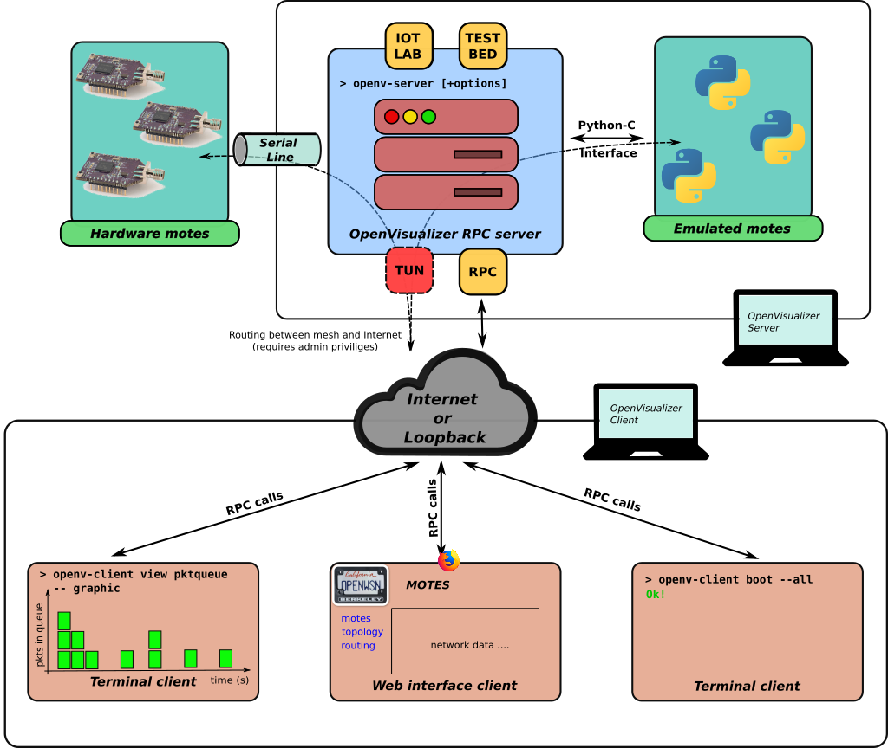

OpenVisualizer
==============

OpenVisualizer (OV) is part of UC Berkeley's OpenWSN project. It provides monitoring, visualization and simulation of OpenWSN-based wireless sensor network. See the project [home page][] for more information.

## Table of Contents
* [Installation](#installation)
    - [Setting up the virtualenv](#setting-up-the-virtualenv)
    - [Installing on OSX or Linux](#installing-on-osx-or-linux)
    - [Installing on Windows](#installing-on-windows)
* [Architecture](#architecture)
* [Usage](#usage)
    - [Prerequisites](#prerequisites)
    - [Real hardware](#real-hardware)
    - [Simulation mode](#simulation-mode)
    - [Other useful options](#other-useful-options)
* [Testing](#testing)
* [Contact](#contact)

## Installation 
OpenVisualizer is distributed through [PyPi][]. The only thing you need is a working Python 2.7 installation and pip. We recommend installing OpenVisualizer in a virtual environment. If something goes wrong you can simply delete the virtual environment without affecting your OS.

#### Setting up the virtualenv 
Install the virtualenv package, in case you do not already have it:

`> pip install virtualenv`

Create a virtual environment (the name can be anything, here we use the name _**venv**_):

`> python -m virtualenv <NAME_OF_YOUR_VIRTUAL_ENV>`

Once installed you need to activate it. On Linux or OSX:

`> source venv/bin/activate`

On Windows:

`> .\venv\Scripts\activate`

#### Installing on OSX or Linux
Once you have your virtualenv set up you can simply type:

`(venv) > pip install openvisualizer`

Pip will download and install all the dependencies. 

#### Installing on Windows
On Windows the instructions are almost the same.

`(venv) > pip install openvisualizer`

After installing OpenVisualizer you need to remove the package `pyreadline`. The latter gets installed by the `coloredlogs` package which is used to support colored logs in the terminal. However, the `pyreadline` package is outdated and buggy on Windows 10. To prevent issues, you should remove it, the log coloring will still work without `pyreadline` installed.

`(venv) > pip uninstall pyreadline`

## Architecture 

The architecture of OpenVisualizer is split up in two main components:

* **OpenVisualizer Server**
* **OpenVisualizer Client**

#### OpenVisualizer Server
The _OpenVisualizer Server_ contains all the code to manage and interact with a mesh network consisting of motes running the OpenWSN firmware. The server can also run the firmware on emulated motes. Mote emulation is particulary useful when you don't have the appropriate hardware or for debugging purposes. Inside the `openvisualizer` Python package there are several subpackages. All of the subpackages, with exception of the package called `client`, implement different parts of the OpenVisualizer Server. Some important components are:

* **motehandler** package enables direct communication between the motes, other components of the _OpenVisualizer Server_ and the _OpenVisualizer Clients_. The motehandler package maintains important information about each mote in the network and provides parsing of the network and mote logs.
* **jrc** package provides an implementation of the "Join Request Proxy". The JRC plays an important role when nodes want to join an existing network securely.
* **rpl** package implements source routing for the motes in the network and provides the user with topology information.
* **opentun & openlbr** are packages that parse network traffic between the mesh network and the Internet. The opentun package specifically allows OpenVisualizer to route network traffic between the Internet and the mesh.

The _OpenVisualizer Server_ is a remote procedure call (RPC) server. It exposes a set of methods that are used by _OpenVisualizer Clients_ to inspect, monitor and manipulate the network or individual motes. 

#### OpenVisualizer Client
There are two types of clients: the "terminal client" and the "web interface client". Both clients connect to the OpenVisualizer Server and use it RPCs to interact with the network and the motes.

## Usage

#### Prerequisites
#### Real hardware
#### Simulation mode
#### Other useful options

## Testing

[home page]: https://openwsn.atlassian.net/wiki/display/OW/OpenVisualizer

[PyPi]: https://pypi.org/

[mailing list]: https://openwsn.atlassian.net/wiki/display/OW/Mailing+List

[issue report]: https://openwsn.atlassian.net

[openwsn-dashboard]: https://openwsn-dashboard.eu-gb.mybluemix.net/ui/

[OpenTestbed]: https://github.com/openwsn-berkeley/opentestbed

[localhost:8080]: http://localhost:8080/
