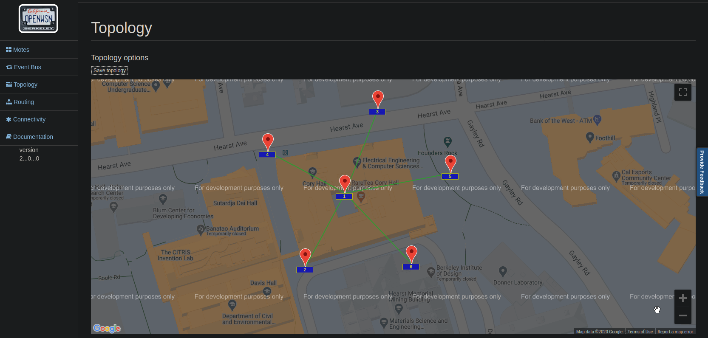

This directory contains several example network topologies saved in JSON format.
The topologies can be loaded by OpenVisualizer with the command:

`openv-server --load-topology=<filename>`

To inspect the topology you can use the web interface:

`openv-server --load-topology=<filename> --webserver=<port>`

Under the tab _topology_ you can see and manipulate the network topology.

